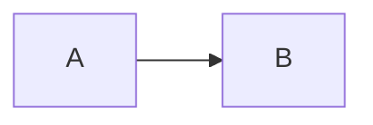

# azdown — hoja de pruebas

Abre este archivo con `Ctrl+K V` y compáralo contra la misma página en un wiki
real de Azure DevOps. Cada sección dice si ya está implementada o pendiente.

[[_TOC_]]

---

## 1. Containers de tres dos puntos — IMPLEMENTADO

### Mermaid

::: mermaid
graph LR
  A[Commit] --> B{CI}
  B -->|pasa| C[Merge]
  B -->|falla| D[Rechazo]
:::

El diagrama **todavía no se dibuja**: el plugin emite `
`
pero falta cargar Mermaid en el webview. Debes ver el código fuente en un div.

### Un code fence NO es un container

Esto tiene que seguir siendo un bloque de código, no un diagrama:

### Video

::: video
<iframe width="560" height="315" src="https://www.youtube.com/embed/dQw4w9WgXcQ" frameborder="0" allowfullscreen></iframe>
:::

### Math (container)

::: math
\frac{n!}{k!(n-k)!} = \binom{n}{k}
:::

Pendiente KaTeX: por ahora se ve la fuente dentro de una caja.

### Kind desconocido

Esto debe quedar como texto plano, no desaparecer:

::: loquesea
contenido que no se debe tragar
:::

---

## 2. Macros — IMPLEMENTADO

El `[[_TOC_]]` de arriba debe listar todos estos encabezados y sus enlaces
deben funcionar al hacer clic.

### Subpáginas

[[_TOSP_]]

Renderiza un placeholder vacío a propósito: listar subpáginas exige el árbol
del wiki, que un `.md` suelto no tiene.

### El macro debe estar solo en su línea

Texto [[_TOC_]] más texto — esto **no** debe generar un índice.

---

## 3. Anclas de encabezado — PARCIAL

Cada encabezado lleva un `id`. El algoritmo de slug es **best-effort y no está
verificado** contra Azure DevOps real.

### Overview

### Overview

Dos encabezados iguales: el segundo debe recibir `overview-1`.

### Título con C# y símbolos raros !@#

### Configuración en español

### 1. Empieza con dígito

Estos cuatro son justo los casos dudosos. Compáralos contra un wiki real.

---

## 4. KaTeX — PENDIENTE

Inline: $E = mc^2$ y bloque:

$$
\int_0^\infty e^{-x^2}\,dx = \frac{\sqrt{\pi}}{2}
$$

Hoy se ve el `$` literal.

---

## 5. Emoji por shortcode — PENDIENTE

:smile: :rocket: :warning: :heavy_check_mark:

Hoy se ven los dos puntos literales.

---

## 6. Enlaces relativos de wiki — PENDIENTE

- [Página hermana](./Otra-Pagina)
- [Con guion escapado](./Build%2DAnd%2DRelease)
- [Subpágina](/Equipo/Onboarding)

El escapado `%2D` importa: en Azure DevOps `A-B` y `A%2DB` son páginas
distintas.

---

## 7. Referencias — PENDIENTE

Work item #123 y pull request !456 deben verse como chips.

Render-only: nunca se pide un PAT ni se conecta a la organización, así que el
chip muestra la referencia y jamás resuelve el título.

---

## 8. GFM base — debe seguir funcionando

| Feature | Estado |
| --- | --- |
| Tablas | ✅ |
| Tachado | ~~así~~ |
| Checklists | ver abajo |

- [x] Tarea hecha
- [ ] Tarea pendiente

> Cita en bloque
> con dos líneas.

`código inline` y un enlace [normal](https://example.test).

---

## 9. Casos borde

### Container indentado cuatro espacios

    ::: mermaid
    esto es un bloque de código

### Overview

Tercer "Overview" del documento: debe recibir `overview-2`.

### Container sin cerrar

Va al final a propósito: un container sin cerrar se come todo lo que sigue,
igual que un code fence sin cerrar.

::: mermaid
graph LR
  A --> B
