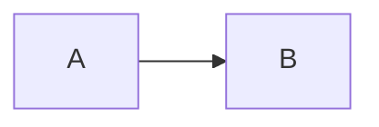

# azdown — test sheet

Open this file with `Ctrl+K V` and compare it against the same page in a real
Azure DevOps wiki. Each section says whether the feature is implemented or not.

[[_TOC_]]

---

## 1. Three-colon containers — IMPLEMENTED

### Mermaid

::: mermaid
graph LR
  A[Commit] --> B{CI}
  B -->|passes| C[Merge]
  B -->|fails| D[Rejected]
:::

The diagram **should be drawn**. Switch the VS Code theme between light and
dark: it should redraw itself in the new theme's colours.

A second diagram, to check that several render:

::: mermaid
sequenceDiagram
  Dev->>CI: push
  CI->>Marketplace: publish
  Marketplace-->>Dev: v0.1.0
:::

### Invalid diagram

This should show Mermaid's error **inside its own box**, and the diagrams above
should stay drawn. If one broken diagram takes the others down, that is a bug:

::: mermaid
graph LR
  A --> --> B[[[
:::

### A code fence is NOT a container

This has to stay a code block, not a diagram:

### Video

::: video
<iframe width="560" height="315" src="https://www.youtube.com/embed/dQw4w9WgXcQ" frameborder="0" allowfullscreen></iframe>
:::

### Math (container)

::: math
\frac{n!}{k!(n-k)!} = \binom{n}{k}
:::

Note that `::: math` is **not** documented Azure DevOps syntax. It is supported
because it was asked for; prefer `$…$` and `$$…$$`, which are documented.

### Unknown kind

This should stay plain text, not disappear:

::: whatever
content that must not be swallowed
:::

---

## 2. Macros — IMPLEMENTED

The `[[_TOC_]]` above should list every heading on this page, titled
**Contents**, and its links should jump when clicked.

Only the first `[[_TOC_]]` renders. This second one should produce nothing:

[[_TOC_]]

### Subpages

[[_TOSP_]]

This renders an empty placeholder on purpose: listing subpages needs the wiki
tree, which a standalone `.md` does not have. Open `sample/wiki/Onboarding.md`
to see it populated.

### The macro must own its line

Text [[_TOC_]] more text — this should **not** produce a table of contents.

---

## 3. Heading anchors — IMPLEMENTED

Every heading carries an anchor. The algorithm follows what Microsoft
documents, including its one published worked example.

### Overview

### Overview

Two identical headings: the second should get `overview-1`.

#### Team #1 : Release Wiki!

This is the **only worked example Microsoft publishes**. The anchor must be
exactly `#team-1--release-wiki`, with the double hyphen. Check that this link
lands here: [Visit the Project Wiki](#team-1--release-wiki).

### Title with C# and odd symbols !@#

### Configuración en español

### 1. Starts with a digit

Those last three are the cases the documentation does not specify. Compare them
against a real wiki.

---

## 4. KaTeX — IMPLEMENTED

Tight inline: $E = mc^2$ — and spaced, as in the Azure DevOps documentation's
own example: $ A + B = C $

Block:

$$
\int_0^\infty e^{-x^2}\,dx = \frac{\sqrt{\pi}}{2}
$$

Prices must **not** be converted: it costs $5 and $10.

An invalid formula should report the error in place: $\frac{broken$

---

## 5. Emoji shortcodes — IMPLEMENTED

:smile: :rocket: :warning: :heavy_check_mark: :+1::+1:

Azure DevOps does **not** support GitHub's custom emoji, so these should stay
literal: :bowtie: :octocat:

Backslash escaping — the colons should show, not the emoji:
\:smile: \:angry: \:cry:

---

## 6. Relative wiki links — IMPLEMENTED

Note: this file is **not** inside a wiki, so none of these resolve and all
should stay exactly as written. Open `sample/wiki/Onboarding.md` to see them
working against a real root.

- [Sibling page](./Another-Page)
- [With an escaped hyphen](./Build%2DAnd%2DRelease)
- [Subpage](/Team/Onboarding)

The `%2D` escape matters: in Azure DevOps `A-B` and `A%2DB` are different pages.

---

## 7. Work item references — DELIBERATELY NOT IMPLEMENTED

Work item #123, pull request !456, colour hex #123456, error #404.

All four should stay **plain text**. In Azure DevOps the `#` is an editor
affordance (autosuggest) that inserts an ordinary link into the file; nothing
documents a saved `#123` becoming a chip, and `!456` does not appear in the
documentation at all.

Converting them automatically would break the last two cases on that line.

---

## 8. GFM basics — must keep working

| Feature | Status |
| --- | --- |
| Tables | ✅ |
| Strikethrough | ~~like this~~ |
| Checklists | see below |

- [x] Done task
- [ ] Pending task

> Block quote
> across two lines.

`inline code` and a [normal link](https://example.test).

---

## 9. Edge cases

### Container indented four spaces

    ::: mermaid
    this is a code block

### Overview

The document's third "Overview": it should get `overview-2`.

### Unclosed container

Last on purpose: an unclosed container swallows everything after it, exactly
like an unclosed code fence.

::: mermaid
graph LR
  A --> B
