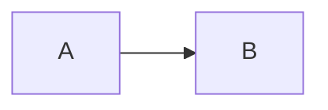

# Diagrams And Math

[Back to the test index](/Smoke-Tests)

[[_TOC_]]

All diagrams and formulas on this page are valid. Error cases are on a
separate page.

## Flow diagram

::: mermaid
graph LR
  A[Write a page] --> B[Preview locally]
  B --> C{Looks correct?}
  C -->|Yes| D[Ready to publish]
  C -->|No| A
:::

Change `Write a page` to another label several times while the preview is open.
Then change the VS Code theme. The final diagram should show the latest text
using the current theme, without flashing back to an older diagram.

## Sequence diagram

::: mermaid
sequenceDiagram
  Author->>Editor: Save Markdown
  Editor->>Preview: Refresh
  Preview-->>Author: Show latest content
:::

Expected: both diagrams render independently and remain readable in light,
dark and high-contrast themes.

## Mermaid as a fenced block



Expected: a diagram. Azure DevOps documents this alongside `::: mermaid`. On
VS Code 1.121 and later it is VS Code's own Mermaid support that draws it.

## A fence in another language

```js
const x = 1;
```

Expected: a code block, untouched.

## Inline and block math

Inline: $E = mc^2$. With internal spaces: $ A + B = C $.

$$
\frac{-b \pm \sqrt{b^2 - 4ac}}{2a}
$$

Expected: mathematical typesetting, no raw TeX and no missing-font squares.
Prices remain ordinary text: $5 and $10.

## Optional math container

::: math
\sum_{k=1}^{n} k = \frac{n(n+1)}{2}
:::

This extension supports `::: math`; its Azure DevOps compatibility is not
verified. Prefer the dollar delimiters when writing shared wiki content.

## Emoji and escaping

Rendered: :smile: :rocket: :warning: :heavy_check_mark:

Literal escaped shortcode: \:smile:

Literal code: `:smile:` and `$E = mc^2$`.

## Normal Markdown styling

| Item | Expected |
| --- | --- |
| **Bold** and *italic* | Both styles remain visible |
| `inline code` | Readable against the theme background |
| ~~Old text~~ | Strikethrough |

> A block quote should have a visible border and readable text.

- [x] Completed item
- [ ] Pending item

```typescript
const preview = { version: '0.1.0', ready: true };
```
